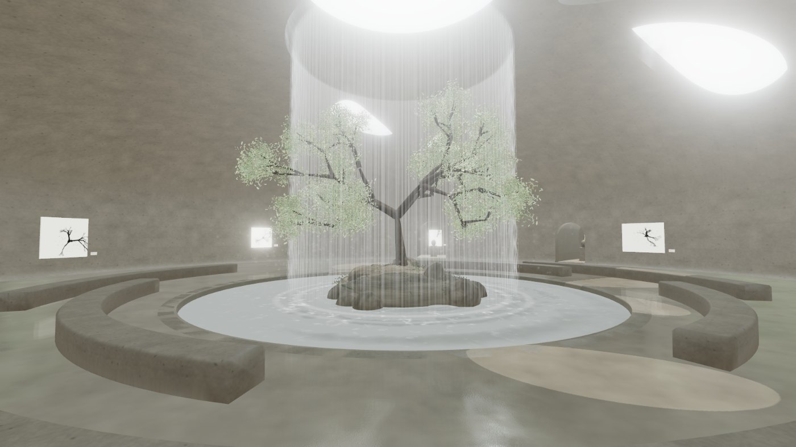

# Stark Museo

A virtual monolithic sanctuary you walk through in third person, as a figure
you dress at the door.



A single tree stands on a rocky island, ringed by a circular pool. A curtain of
water falls from an opening in the concrete dome overhead. Daylight comes in
through organic skylights cut through the shell, and the artworks hang on the
raw curved wall with concentric seating between them.

Before going in, visitors dress a figure from a rack of garments — which is
where brand placements live. At the pool's edge they can throw a coin in the
water and leave an anonymous wish.

It is one static website — no build step, no dependencies to install.
Everything you see is generated in the browser at load time: the concrete, the
stone, the water, the tree, and the placeholder canvases are all drawn from
code, so the whole thing is about a megabyte.

---

## Hanging your own work

**This is the only file you need to touch: [`js/artworks.js`](js/artworks.js).**

1. Put your image files in the `artworks/` folder.
2. Open `js/artworks.js` and fill in one entry per piece:

```js
{
  src:    'artworks/fracture-i.jpg',   // your file
  title:  'Fracture I',
  year:   '2024',
  medium: 'Ink on raw cotton',
  size:   '150 × 150 cm',              // free text, shown on the wall label
  note:   'A sentence or two, shown when a visitor looks closely.',
  width:  1.70,                        // how wide it hangs, IN METRES
  height: 1.70
}
```

3. Refresh the page. The room re-hangs itself around however many pieces you list.

Notes:

- **`width` is the one that matters.** It is the real width of the piece on the
  wall, in metres, and it is what makes the space feel true. `1.7` is a large
  canvas; `0.8` is a small one. Height is taken from your image's own
  proportions so nothing gets stretched — set `lockSize: true` if you would
  rather have your declared `height` used exactly.
- Leave `src: null` and a placeholder canvas is generated instead, so the room
  always looks finished while you are still filling it in.
- `place: 'chamber'` hangs a piece in one of the two side rooms instead of the
  main hall.
- `angle: 210` pins a piece to a specific bearing in degrees. Omit it and the
  gallery spaces everything evenly along the free wall, skipping the doorways.
- The exhibition title, subtitle and wall text on the entrance card are at the
  bottom of the same file, under `EXHIBITION`.

Any format the browser can display works — `.jpg`, `.png`, `.webp`. Keep the
long edge around 2000px; larger files only cost your visitors load time.

---

## Putting it online

The repository *is* the website.

1. Create a repository on GitHub and push this folder to it.
2. Repository **Settings → Pages → Source: Deploy from a branch**, branch
   `main`, folder `/ (root)`.
3. A minute later it is live at
   `https://<your-username>.github.io/<repository-name>/`.

The `.nojekyll` file is there so GitHub serves the folders as-is. Nothing else
is required — no Actions, no build.

### Looking at it on your own machine

**Double-click `start.cmd`** (or `start.sh` on Mac and Linux). It starts a tiny
local server and opens the sanctuary in your browser. Leave the black window
open while you look around; close it when you are done.

From a terminal, the same thing:

```bash
node serve.mjs
```

**Do not open `index.html` by double-clicking it.** It will sit on
*"preparing the room"* and never start. That is not a bug in the sanctuary — a
browser refuses to load JavaScript modules straight from a folder, because it
treats every local file as coming from a different origin. The page will tell
you as much if you try. Any local web server fixes it, including the one above,
or `python -m http.server 8123` if you would rather.

None of this affects the published site. On GitHub Pages it is served over
`https://`, so it simply works.

---

## Walking through it

| | |
|---|---|
| `W` `A` `S` `D` or arrows | walk — the figure turns to face where it is going |
| mouse | swing the camera — click once to capture the pointer, `Esc` to release |
| scroll | pull the camera in or push it back |
| `Shift` | walk faster |
| `E` or click | look closely at whatever you are facing |
| `G` | use what you are carrying — drink, take a picture, take a draw |
| `F` | at the pool's edge, throw a coin in |
| `T` | guided walk — the figure walks itself round; any key takes over |
| `Esc` | pause, settings |

On a phone or tablet: left thumb walks, right thumb swings the camera, and the
two round buttons on the right do whatever is offered.

Visitors who would rather not drive can press **"Or simply watch"** on the
entrance card and the sanctuary shows itself.

The pause menu has detail (High / Medium / Low), sound, look sensitivity,
field of view, and an invert-vertical toggle. Detail defaults to High on a
desktop and Medium on a touch device; changing it rebuilds the room, which
takes a second or two.

Sound is synthesised in the browser — the falling water is filtered noise
positioned in the room, so it swells as you approach the pool and falls behind
you when you step into a side chamber. There are no audio files.

---

## The wardrobe, and brand placements

**Edit [`js/wardrobe.js`](js/wardrobe.js).**

Visitors dress a figure before they walk in — two tops, two bottoms, two pairs
of shoes, a choice of headwear, and something to carry. Each entry carries a
brand name, an item name, colours, and optionally a graphic printed on the
chest:

```js
{
  id:      'top-ecru',
  brand:   'YOUR PARTNER',
  name:    'Boxy Tee',
  note:    'Heavyweight cotton',
  color:   0xefe9dd,          // main colour
  trim:    0xe2dacb,          // collar and cuffs
  graphic: 'brands/partner.png',   // optional chest print, PNG with alpha
  sleeve:  'short'            // or 'long'
}
```

Put logo PNGs in a `brands/` folder next to `artworks/`. A missing file is
skipped with a warning rather than breaking the rack.

**The names shipped in that file are placeholders** — `BRAND ONE`, `BRAND TWO`
and so on. They are deliberately generic and imply nothing about any real
company. Replace them with your partners' names before you show this to
anyone.

What a visitor carries is not decoration: press `G` inside and the figure
drinks, takes a photograph, or takes a draw, with the sound to match.

The figure itself is faceless on purpose. A crudely modelled face is the first
thing anyone looks at; a bare one keeps the eye on the clothes.

---

## The coin in the water

Walk to the pool's edge and a prompt offers a coin. Choose an amount, the
figure throws, the water rings out from where it lands, and a box opens to
write an anonymous wish. Coins settle on the basin floor and stay there, so
the pool slowly fills.

**Out of the box this takes no money.** It runs in demo mode: everything
works, the wish is saved in the visitor's own browser, and the panel says
plainly that no card is charged.

To take real money — €1 and €2 through Apple Pay and Google Pay — follow
[`supabase/README.md`](supabase/README.md). It needs a Stripe account and a
Supabase project, and it is written to be followed start to finish. The short
version:

- Stripe's own sheet takes the card; your code never touches card details.
- A Supabase edge function holds the only secret and is the only thing that
  can write a wish.
- **The browser is never believed about whether money changed hands.** The
  function asks Stripe directly before a wish is recorded.
- Wishes are anonymous: no name, no email, no session id. Only the words.

Amounts, currency and the wording of every panel live in
[`js/payments.config.js`](js/payments.config.js).

---

## Changing the building

Every dimension is in [`js/config.js`](js/config.js), in metres. It is meant to
be edited. A few of the ones worth playing with:

| | |
|---|---|
| `HALL.radius` | how wide the room is (15 m) |
| `HALL.wallHeight` / `domeRise` | where the wall stops and the dome springs |
| `OCULUS.radius` | the round opening the water falls from |
| `SKYLIGHTS` | one entry per opening cut in the dome — position, size, tilt |
| `ALCOVES` | the arched doorways and the chambers behind them |
| `POOL` / `ISLAND` / `TREE` | the centrepiece |
| `BENCHES` | the concentric seating, as arcs you can break wherever you like |
| `PALETTE` | every colour in the building |

The openings are genuinely cut through the shell, so moving a skylight moves
the hole, the concrete reveal around it, the daylight coming through it, and
the pool of light it throws on the floor.

---

## How it is put together

```
index.html          the page, the import map, the interface markup
css/style.css       the interface
js/
  config.js         every dimension in the building
  artworks.js       ← your work goes here
  textures.js       concrete, stone, foliage, water and ink, drawn procedurally
  architecture.js   the shell, its openings, the floor, seating, side chambers
  water.js          the pool surface, the falling curtain, mist, light shafts
  nature.js         the island and the tree
  gallery.js        where the work hangs, how it is lit and labelled
  wardrobe.js       ← brand placements go here
  character.js      the figure, its clothes and how it moves
  coin.js           coins in flight, and the pile on the basin floor
  wishes.js         payment and the wish book
  payments.config.js  ← Stripe and Supabase settings
  player.js         third-person movement, collision and the camera arm
  tour.js           the guided walk
  audio.js          synthesised water and room tone
  ui.js             entrance, pause menu, the reading panel
  main.js           assembly and the frame loop
serve.mjs           tiny local preview server (not used by the published site)
start.cmd / .sh     double-click to preview locally
vendor/three/       three.js r185 (MIT), vendored so nothing is fetched at runtime
supabase/           schema and edge function for real payments
artworks/           your image files
brands/             partner logos for chest prints (optional)
```

A few decisions worth knowing about if you go poking around:

- **The shell is one surface with real holes in it.** It is generated as a
  polar grid over a revolved profile; each opening is described in the shell's
  own surface coordinates, so an ellipse stays an ellipse however the surface
  curves. Vertices inside an opening are dropped and vertices just outside are
  snapped exactly onto its rim, which gives a clean edge without needing a
  dense mesh.
- **The concrete is projected from world space, not UV-mapped.** A revolved
  shell cannot be unwrapped cleanly — the texture either shears or compresses
  as the dome narrows, and either way it smears into radial streaks around the
  oculus. Projecting on all three axes and blending by the normal sidesteps it,
  and gives the swept seating, which carries no UVs at all, a surface for free.
- **The dome casts its own shadow**, so daylight only reaches the floor through
  the openings. The building and the sun never move, so the shadow map is drawn
  once at load and then frozen — the pools of light on the floor are free.
- **The pool does not use a reflection pass.** It reflects an analytic room
  instead: a pale dome with the oculus punched into it. Cheap, stable, and it
  makes the opening dance across the ripples.
- **The tree is grown, not modelled** — a recursive skeleton swept into tapered
  tubes, with about 2,300 leaf clusters hung on the tips as instanced quads
  that drift in a slow wind.
- **The figure is built the same way.** Lofted tubes joined by spheres exactly
  as wide as the tubes they join, so a limb can rotate without ever opening a
  seam. Every garment is a second, slightly larger shell parented to the same
  joint, which is why a top can be swapped without touching the body.
- **The camera arm is clamped analytically, not raycast.** The room is a known
  shape — a cylinder capped by an ellipsoidal dome, plus two rectangular
  chambers — so the arm is shortened until its end sits somewhere legal. It is
  exact, costs nothing, and cannot tunnel through a wall the way a ray can.
- **The figure's shadow is a soft patch, not a shadow map.** The building's
  shadows are drawn once and frozen, which is what makes the light pools free;
  a moving figure cannot use that, and under this diffuse light a soft contact
  shadow is closer to the truth than a sharp one anyway.

---

## Credits

Built with [three.js](https://threejs.org) (MIT), vendored in `vendor/three/`.
Everything else is generated at runtime.
